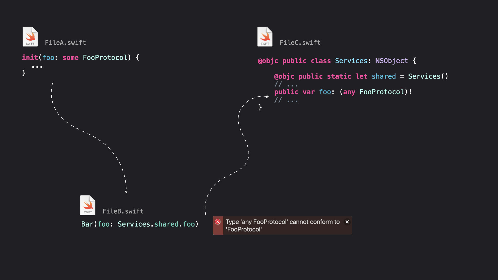

<h1 align="center">
  
  <br>
</h1>

# SwiftSomeAnyMigrator
A tool to help you migrate your Swift code to new any and some keywords.

# How to use
1. Download the release on Github 
2. Run

```swift
SwiftSomeAnyMigratorCommandLineTool ./your/path/folder
    --ignoreFolders "FooFolder, BarFolder" \
    --policy strict \
    --conservative
```

# How it works
SwiftSomeAnyMigrator will found all the Swift files recursively for a given path and will add `some` or `any` based on your policy.

## Policy option
You can use `--policy strict` or `--policy light`.  
`light` use `any` everywhere while `strict` will try to introduce `some` keywords whenever think it's possible.  

_Example_:
Using `strict` mode (more optimized but less chance to compile out of the box)

```swift
// Before
init(
  a: FooProtocol = Foo(),
  b: FooProtocol = FooSingleton.shared
)

func foo(FooProtocol){}

// After
init(
  a: some FooProtocol = Foo(),
  b: any FooProtocol = FooSingleton.shared
)

func foo(some FooProtocol){}
```
Using `light` mode (more chance to compile but less optimized)

```swift
// Before
init(
  a: FooProtocol = Foo(),
  b: FooProtocol = FooSingleton.shared
)

func foo(FooProtocol){}

// After
init(
  a: any FooProtocol = Foo(),
  b: any FooProtocol = FooSingleton.shared
)

func foo(any FooProtocol){}
```

## Conservative flag
If you add `--conservative` flag, the tool will keep pre-existing `any` or `some` keyword encountered in your codebase.

# F.A.Q
### Why is my code does not compile after running a `strict` migration ?
SwiftSomeAnyMigrator is only making static analysis he could not understand what is really injected and can only make syntax guess. Because of this, his guess could be wrong sometimes. It does NOT mean you should always use `light` mode. SwiftSomeAnyMigrator is an helper tool to cover a maximum of cases, resulting to the developer to only arbitrate a bunch of cases after the tool have runned instead of the whole codebase.

<h1 align="center">
  
</h1>

### What about performance ?
SwiftSomeAnyMigrator uses SwiftConcurrency behind the hood to apply changes concurrently and faster to your codebase.
6.2 sec. for 1k files.